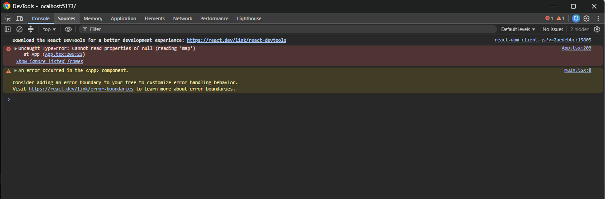
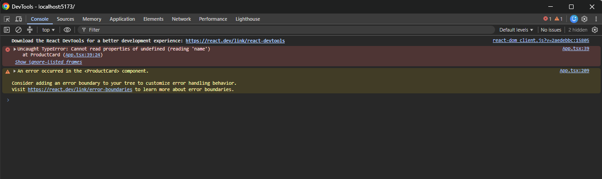
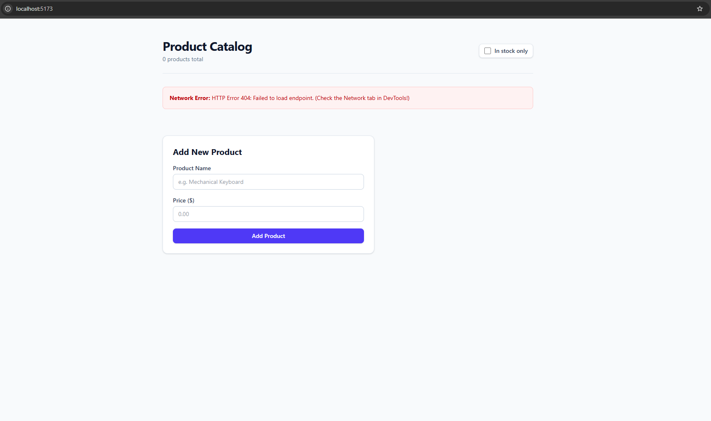
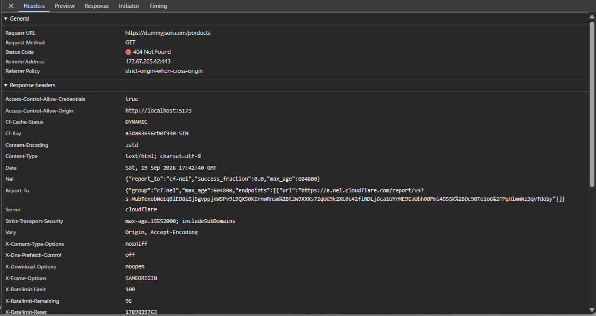

# Product Catalog

React + TypeScript mini-app focused on strong typing and debugging.

## TypeScript

- Typed `Product`, form, error, and component props.
- Typed `ChangeEvent` and `FormEvent` handlers.
- `useState<Product[]>` for product data.
- Used `Omit` and `Partial` for derived types.
- Used optional chaining (`?.`) and nullish coalescing (`??`).

## TypeScript Check

```bash
npx tsc --noEmit
```

The project passes the TypeScript check with no implicit `any`.

## Screenshot

### TypeScript Error

.map() on Null State



.wrong value



.Network Error





I used **Chrome DevTools** to debug all three bugs—the debugger helped trace the null `.map()` crash, inspect the wrong value, and identify the failed network request, while the console alone did not provide enough context to trace each problem to its source.
